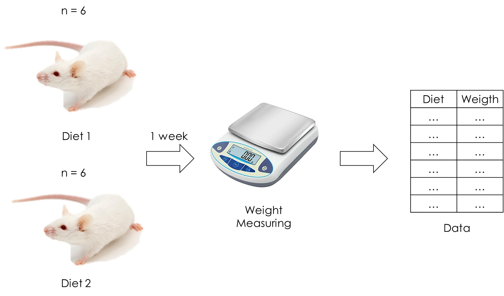

R in the Lab: Two Treatments Comparison
================

# Two-Treatments-Comparison

R in the Lab: Two Treatments Comparison

A brief R tutorial about how to perform a comparison analysis between
two treatments data. This is performed through a t-Test, summarizing and
graphing the data.

Please, consult the pdf\_document.pdf or the github\_document.md in the
document\_presentation folder to see an explanation about the data
analysis. Note that I didn’t explain how I simulated the experimental
data, but you can see the code on data\_simulation.R

If you have cloned this repository and want to run this analysis from
scratch first run erase\_all\_outputs.R script and then run Main.R
script o whichever script you want.

Juan Pablo Carreón Hidalgo

<jpch_26@outlook.com>

 

## 1\. Problem

You want to know if the consumption of a certain kind of fat can
increase drastically the weight. With this purpose you decide to perform
an experiment using some mouses. You have twelve animals and you
randomly assign a different diet to each one. You will feed six mice
with a diet containing the strange fat (diet 1) and the other six will
eat a regular diet without any addition (diet 2).



After a week you measure and register the weight of each mouse, So your
data look like this:

<table class=" lightable-classic-2" style='font-family: "Arial Narrow", "Source Sans Pro", sans-serif; width: auto !important; margin-left: auto; margin-right: auto;'>

<caption>

Experimental data

</caption>

<thead>

<tr>

<th style="text-align:left;">

Mouse Code

</th>

<th style="text-align:right;">

Diet

</th>

<th style="text-align:right;">

Weight (g)

</th>

</tr>

</thead>

<tbody>

<tr>

<td style="text-align:left;">

5HF

</td>

<td style="text-align:right;">

1

</td>

<td style="text-align:right;">

21.99

</td>

</tr>

<tr>

<td style="text-align:left;">

Y5Y

</td>

<td style="text-align:right;">

1

</td>

<td style="text-align:right;">

24.66

</td>

</tr>

<tr>

<td style="text-align:left;">

G29

</td>

<td style="text-align:right;">

1

</td>

<td style="text-align:right;">

21.49

</td>

</tr>

<tr>

<td style="text-align:left;">

10H

</td>

<td style="text-align:right;">

1

</td>

<td style="text-align:right;">

23.08

</td>

</tr>

<tr>

<td style="text-align:left;">

LLE

</td>

<td style="text-align:right;">

1

</td>

<td style="text-align:right;">

25.05

</td>

</tr>

<tr>

<td style="text-align:left;">

ET8

</td>

<td style="text-align:right;">

1

</td>

<td style="text-align:right;">

22.28

</td>

</tr>

<tr>

<td style="text-align:left;">

TJX

</td>

<td style="text-align:right;">

2

</td>

<td style="text-align:right;">

18.48

</td>

</tr>

<tr>

<td style="text-align:left;">

JR2

</td>

<td style="text-align:right;">

2

</td>

<td style="text-align:right;">

18.30

</td>

</tr>

<tr>

<td style="text-align:left;">

SMD

</td>

<td style="text-align:right;">

2

</td>

<td style="text-align:right;">

18.69

</td>

</tr>

<tr>

<td style="text-align:left;">

KXZ

</td>

<td style="text-align:right;">

2

</td>

<td style="text-align:right;">

19.15

</td>

</tr>

<tr>

<td style="text-align:left;">

XD9

</td>

<td style="text-align:right;">

2

</td>

<td style="text-align:right;">

20.35

</td>

</tr>

<tr>

<td style="text-align:left;">

974

</td>

<td style="text-align:right;">

2

</td>

<td style="text-align:right;">

18.12

</td>

</tr>

</tbody>

</table>

Each column on your experimental data should correspond to a different
mouse, here represented with a random code. Remember, always be cautious
and be sure to assign randomly the treatment to each individual.

You want to establish if there is a statistical significant difference
between the diet treatments. Does the fat in diet 1 increase (or reduce)
the mouse weight after a week?

 

## 2\. Solution

First, I am assuming that you already know the R basics and, of course,
you have installed R already. I am also using RStudio.

Second, I recommend you to organize your files as follows:


These folders should be contained in a main folder with a representative
name.

  - The analysis folder contains my R scripts, one script for each
    individual analysis.
  - The data folder contains my data, my experimental data products and
    my analysis products when their outputs produce text or CSV files.
  - The graphs folder contains the graphical outputs produced by their
    correspond R scripts.

This organization is not a kind of rule of thumbs. You can organize your
files other ways as long as you can ensure the reproducibility and
clarity of your analysis.

Finally, let’s perform a Student’s t-Test, summarize and make some
visual representations of our data.

 

### 2.1 t-Test

Basically, a t-Test will compare the diet means taking into account the
variation and the sample size of each group. You can perform this
analysis following the next code:

``` r
# t test on main data assuming equal variances ---------------------------

# 1 Import data

data <- read.csv("data/main_data.csv")

# 2 Perform a t test between the two treatments

t_test <- t.test(
  weight ~ diet,
  data = data,
  alternative = "two.sided",
  mu = 0,
  var.equal = TRUE
  ) 

# 3 Save de default output for t.test function

capture.output(t_test, file = "data/t_test_output2.txt")
```

As can you see, I performed this analysis following three steps:

  - On the first step I imported the experimental data. This file is in
    CSV (comma-separated values) format and is located on my data
    folder, so the path that I wrote on this command must contain the
    folder name.
  - On the second step I ran the t-Test properly.
  - I saved the analysis result on a file called “t\_test\_output2.txt”
    and I stored it on the folder called “data”.

In the function `t.test`, the argument `weight ~ diet` indicates that I
want to consider the variable `weight` depended on the variable `diet`.
`data = data` indicates that the data is stored in the object called the
same way. `alternative = "two.sided"` establish that we want to perform
a two-tailed t test, so we are testing for the possibility of the
difference between means on both directions (a positive or negative
difference). `mu = 0` indicates the true value of the distribution mean
and `var.equal = TRUE` indicates that our populations have the same
variance.

When you type `t_test`, or open your text file, you’ll see your analysis
result:

``` r
t_test
```

    ## 
    ##  Two Sample t-test
    ## 
    ## data:  weight by diet
    ## t = 6.196, df = 10, p-value = 0.000102
    ## alternative hypothesis: true difference in means is not equal to 0
    ## 95 percent confidence interval:
    ##  2.717393 5.769273
    ## sample estimates:
    ## mean in group 1 mean in group 2 
    ##        23.09167        18.84833

Clearly, this result shows that the diet containing the strange fat
(diet 1) increased the weight mice.

You can type `?t.test` for more information about this function.

How can you be you sure about the equality of variances (the argument
specified as `var.equal = TRUE`)? You can perform the next code:

``` r
# F test for treatments equal variance ---------------------------------------

# Import data 

data <- read.csv("data/main_data.csv")

# F test

f_test <- var.test(weight ~ diet, data = data)

# Save f_test output

capture.output(f_test, file = "data/f_test_output.txt")
```

If you type `f_test`, or open your text file, you will see the result:

``` r
f_test
```

    ## 
    ##  F test to compare two variances
    ## 
    ## data:  weight by diet
    ## F = 3.2154, num df = 5, denom df = 5, p-value = 0.2257
    ## alternative hypothesis: true ratio of variances is not equal to 1
    ## 95 percent confidence interval:
    ##   0.4499362 22.9785902
    ## sample estimates:
    ## ratio of variances 
    ##           3.215416

What does this mean? Briefly, it means that you can consider both
variances equal. If the p-value would have been minor than 0.05, you
would have had enough evidence to say that both parameters were
different (variances not equal).

When the variances are not equal, you can correct your code simply by
changing `var.equal = TRUE` for `var.equal = FALSE`. The last one is the
default value, so you can simply skip it:

``` r
# t test main data -------------------------------------------------------

# 1 Import data

data <- read.csv("data/main_data.csv")

# 2 Perform a t test between the two treatments

t_test <- t.test(
  weight ~ diet,
  data = data,
  alternative = "two.sided",
  mu = 0
  ) 

# 3 Save de default output for t.test function

capture.output(t_test, file = "data/t_test_output.txt")
```

You can see your results:

``` r
t_test
```

    ## 
    ##  Welch Two Sample t-test
    ## 
    ## data:  weight by diet
    ## t = 6.196, df = 7.8357, p-value = 0.0002837
    ## alternative hypothesis: true difference in means is not equal to 0
    ## 95 percent confidence interval:
    ##  2.658286 5.828380
    ## sample estimates:
    ## mean in group 1 mean in group 2 
    ##        23.09167        18.84833

At this example there is no such big difference, but always it is better
to be sure so you can reach good conclusions about your results.

 

### 2.2 Summary

Next, let’s make a summary table with relevant information about our
experimental data. It’s usual to include the mean and the standard
deviation of each one of your treatments, but maybe you want to include
more information.

I’ll use the `dplyr` package accomplish this.

``` r
library(dplyr)
```

``` r
# Summarizing main data ------------------------------------------------------

# 1 Import data

data <- read.csv("data/main_data.csv")

# 2 Summarize using dplyr

sum_table <- data %>% 
  group_by(diet) %>% 
  summarize(
    min    = min(weight),
    max    = max(weight),
    range  = max - min,
    mean   = round(mean(weight), 2), 
    median = round(median(weight), 2),
    sd     = round(sd(weight), 2),
    cv     = round((sd / mean) * 100, 2)
  )

# 3 Save summary

write.csv(sum_table, file = "data/summary_table.csv", row.names = FALSE)
```

`group_by()` tells to `summarize()` to perform the operations by
grouping by diet. This way, `summarize()` will obtain the statistics we
want for each diet. Within this function we specify which operation we
want to perform over the response variable (the mice weight).

I performed this analysis following the same pattern: import your data
\> make your analysis \> save your results. You can skip the first step
if you are working on the same session. Personally, I prefer to work on
a “modular way” (one script for each analysis), thus I can reproduce or
edit an analysis without depending on another one.

If you save your tables as CSV files, when you edit them to look better,
be sure to save it as XLS files or a related one, this way you won’t
lose your editions. I’m using the `kableExtra` package to write this
document, so I can obtain the next table:

<table class=" lightable-classic-2" style='font-family: "Arial Narrow", "Source Sans Pro", sans-serif; width: auto !important; margin-left: auto; margin-right: auto;'>

<caption>

Data summary

</caption>

<thead>

<tr>

<th style="text-align:right;">

Diet

</th>

<th style="text-align:right;">

Min

</th>

<th style="text-align:right;">

Max

</th>

<th style="text-align:right;">

Range

</th>

<th style="text-align:right;">

Mean

</th>

<th style="text-align:right;">

Median

</th>

<th style="text-align:right;">

SD

</th>

<th style="text-align:right;">

CV (%)

</th>

</tr>

</thead>

<tbody>

<tr>

<td style="text-align:right;">

1

</td>

<td style="text-align:right;">

21.49

</td>

<td style="text-align:right;">

25.05

</td>

<td style="text-align:right;">

3.56

</td>

<td style="text-align:right;">

23.09

</td>

<td style="text-align:right;">

22.68

</td>

<td style="text-align:right;">

1.47

</td>

<td style="text-align:right;">

6.37

</td>

</tr>

<tr>

<td style="text-align:right;">

2

</td>

<td style="text-align:right;">

18.12

</td>

<td style="text-align:right;">

20.35

</td>

<td style="text-align:right;">

2.23

</td>

<td style="text-align:right;">

18.85

</td>

<td style="text-align:right;">

18.59

</td>

<td style="text-align:right;">

0.82

</td>

<td style="text-align:right;">

4.35

</td>

</tr>

</tbody>

</table>

 

### 2.3 Plots

Finally, let’s represent our data by doing a good graph. Frequently this
is performed by making a bar graph to represent each treatment mean and
its standard deviation as an error bar.

I’ll use `ggplot2` to make this:

``` r
library(ggplot2)
```

I recently found useful to set a global theme that can be applied to
each graph. I put this code in a separate script, and run it first:

``` r
# Set theme for all graphs ------------------------------------------------

theme_set(
  theme_classic() +
    theme(axis.text.x = element_text(color = "black", size = 13),
          axis.text.y = element_text(color = "black", size = 13),
          axis.title = element_text(color = "black", size = 15))
)
```

``` r
source("analysis/theme.R")
```

On this chunk of code I just settled the classic theme
(`theme_classic()`) and changed the default color and size of
`axis.text.x`, `axis.text.y` and `axis.title`. You can customize your
plot themes in multiple ways, but personally I prefer to keep it as
simple as possible.

The next code produces a bar graph using the summary table made in the
last section.

``` r
# Bar Graph for summary table -------------------------------------------------

# 1 Importing the data

sum_table <- read.csv("data/summary_table.csv")

# 2 Bar graph

bar_graph <- ggplot(data = sum_table, aes(x = as.factor(diet), y = mean)) +
  geom_col(width = 0.2, color = "black", fill = "royalblue1") +
  geom_errorbar(aes(ymin = mean - sd, ymax = mean + sd), width = 0.05) +
  xlab("Diet") +
  ylab("Weight (g)")

# 3 Save plot

ggsave(bar_graph, filename = "graphs/bargraph.jpeg")
```

I followed the same pattern than in the last sections: import data \>
make the graph \> save the graph.

`data = sum_table` set where is our data while the code `x =
as.factor(diet)` indicates to the functions consider the variable `diet`
on the x axis as a categorical variable, not as continuous one. `y =
mean` set which variable will be plotted on the y axis (the `mean`
column in `sum_table`) . `xlab()` changes the default x axis label,
likewise `ylab()` that changes the default y axis label.

In the last command (`ggsave(bar_graph, filename =
"graphs/bargraph.jpeg")`), I saved my plot as a JPEG file on my graphs
folder. You can click on it to see the results or type on your console:

``` r
bar_graph
```

<!-- -->

R and RStudio allow us to be a bit creative and represent our data in
other ways. The next code will made a point graph for each diet, with a
horizontal blue line representing the median.

``` r
# Point graph for each category -------------------------------------

# 1 Importing the data

data <- read.csv("data/main_data.csv")

# 2 Point graph

point_graph <- ggplot(data = data, aes(x = as.factor(diet), y = weight)) +
  geom_point() + 
  stat_summary(fun = median, geom = "crossbar", width = 0.2, col = "blue") +
  xlab("Diet") +
  ylab("Weight (g)") 

# 3 Save plot

ggsave(point_graph, filename = "graphs/pointgraph.jpeg")
```

Note that I’m using the original data, not the summary table, so each
point represents a mice’s weight. Also note that I replaced the
`geom_bar()` function by the `geom_point()` one. The function
`stat_summary()` will include the median of each treatment as a
horizontal blue line. You can specify another statistic with the
argument `fun`.

At the end the code will produce the next graph:

``` r
point_graph
```

<!-- -->

`ggplot2` works like stacking layers, each layer containing a plot
element. This enables to combine different types of graphs. The next
code combines the bar and point graphs:

``` r
# Bar Graph for summary table -------------------------------------------------

# 1 Importing the data

sum_table <- read.csv("data/summary_table.csv")
data <- read.csv("data/main_data.csv")

# 2 Bar graph

barpoint_graph <- ggplot(data = sum_table, aes(x = as.factor(diet), y = mean)) +
  geom_col(
    width = 0.2, 
    color = "black", fill = "royalblue1"
    ) +
  geom_errorbar(
    aes(ymin = mean - sd, ymax = mean + sd), width = 0.05
    ) +
  geom_point(
    data = data, 
    aes(x = as.factor(diet), y = weight), 
    color = "blue4", size = 1.5
    ) +
  xlab("Diet") +
  ylab("Weight (g)") 

# 3 Save plot

ggsave(barpoint_graph, filename = "graphs/barpointgraph.jpeg")
```

You need to tell to `geom_point()` which data use, otherwise it will use
the `summary_table` data specified on the `ggplot()` function.

``` r
barpoint_graph
```

<!-- -->

Maybe it doesn’t seem to be a real change, but in some cases bar plots
will tend to hide the real distribution of your data. Click the next
link to find more information:
[\#BarBarPlots\!](https://thenode.biologists.com/barbarplots/photo/)

That’s it\! I think there is no better way to learn than learn by doing.
Why don’t you try to reproduce all this analysis by yourself? Try to use
your own data\! You can even clone the repository for this analysis and
reproduce it step by step from scratch:

[Simple Mean Analysis
Repository](https://github.com/jpch26/Two-Treatments-Comparison)

Feel free to modify, improve or extend the code. It’s all yours\!
